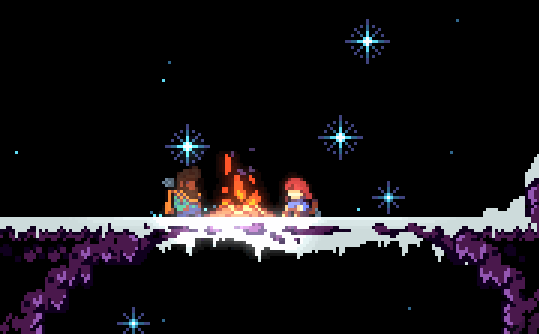
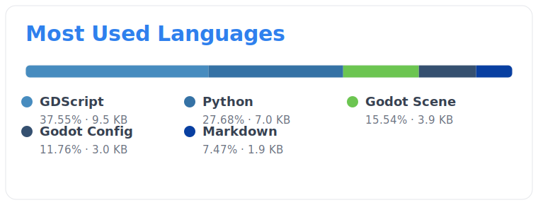

## 🍓 Celeste 🍓

**a fan-made version of Celeste**

  
  
  
  

## Project Overview

| Item | Details |
| --- | --- |
| **Project Name** | CelestePrototype |
| **Engine** | Godot 4.6 |
| **Primary Language** | GDScript |
| **Renderer** | Forward Plus |
| **Physics Engine** | Jolt Physics |
| **Rendering Driver** | DirectX 12 (Windows) |
| **Window Resolution** | 960 x 540 |
| **Main Scene** | `res://scenes/Main.tscn` |

## Language Breakdown

<!-- LANGUAGE-STATS:START -->

  

<!-- LANGUAGE-STATS:END -->

## Quick Start

1. Open the project root with Godot 4.6 or newer.
2. Make sure the main scene is set to `res://scenes/Main.tscn`.
3. Press Play to start debugging.

## Controls

| Action | Key |
| --- | --- |
| Move | Arrow keys |
| Jump | `Z` |
| Dash | `C` |
| Grab | `X` |

## Project Structure

| Path | Description |
| --- | --- |
| `scripts/` | GDScript files for player control, camera behavior, and gameplay logic |
| `scenes/` | Godot scene files |
| `levels/` | Game levels |
| `assets/` | Game assets |
| `doc/` | Project documentation and generated images |
| `tools/` | Local maintenance scripts |

## License
> [!important]
> This project is licensed under the **[GNU General Public Licence version 3](./LICENSE)**.
